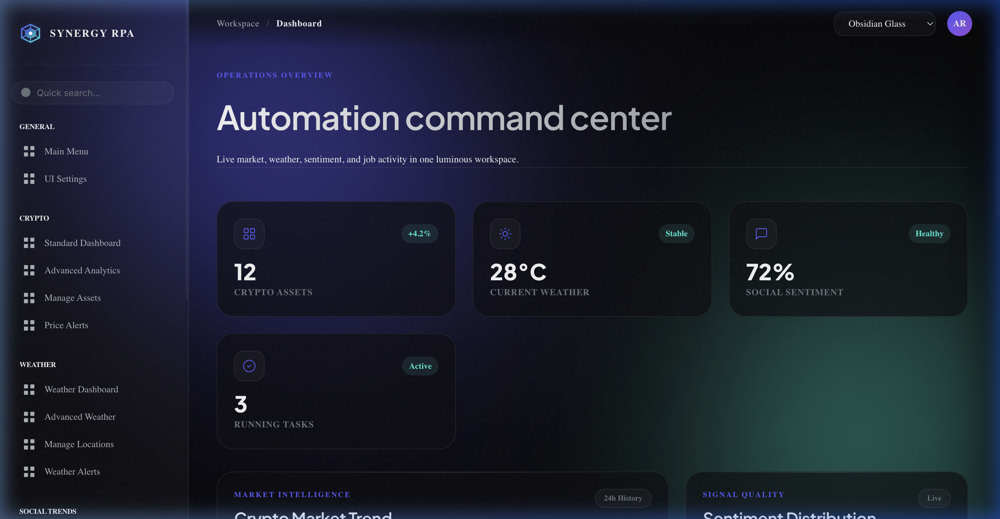
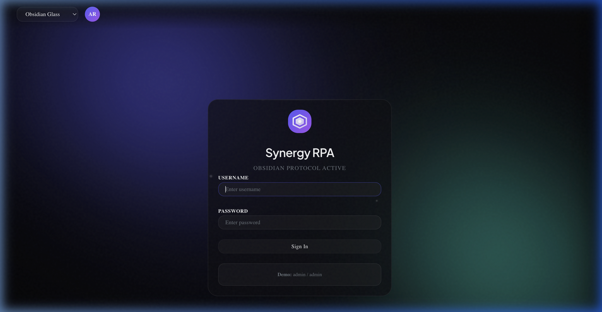

# Synergy RPA - Obsidian Glass Edition



## 🌌 Overview
**Synergy RPA** is a high-performance, intelligent automation dashboard built for modern founders and engineers. This edition features the **Obsidian Glass** UI overhaul—a premium, dark-mode design system that utilizes deep glassmorphism, neon accents, and fluid motion to deliver an elite user experience.

The platform integrates real-time crypto market intelligence, weather analytics, and system automation into a single, cohesive command center.

---

## ✨ Key Features

### 💎 Obsidian Glass UI
- **Glassmorphic Architecture**: Translucent panels with multi-layer background blur and noise textures.
- **Dynamic Motion System**: Staggered entrance animations, drifting background particles, and organic "breathing" aura glows.
- **Micro-Interactions**: Shimmer effects on hover, kinetic button feedback, and fluid sidebar transitions.

### 📊 Intelligent Modules
- **Crypto Market Intelligence**: Real-time tracking of 15+ major cryptocurrencies with sentiment distribution and trend analysis.
- **Weather Command Center**: Global weather snapshots, detailed analytics, and intelligent alerts.
- **Automation Hub**: Real-time tracking of RPA jobs, running tasks, and system status.
- **Signal Fusion**: Integrated reporting that combines multi-source data into actionable insights.

### 🛠️ Advanced Functionality
- **Dynamic Theme Engine**: Persistent theme switching (Obsidian Glass / Midnight Nebula) saved directly to the database.
- **Management Suite**: Integrated user profile management and secure authentication.
- **Real-time Notifications**: Slide-out glass panel for system alerts and data sync confirmations.

---

## 📸 Interface Preview

### Login Experience
The login portal features a high-fidelity entrance animation and the pulsing Synergy brand mark.


### Main Command Center
A unified view of all critical automation and intelligence metrics.


---

## 🚀 Quick Start

### 1. Prerequisites
- Python 3.8+
- MySQL Server
- Flask & Dependencies (`pip install -r requirements.txt`)

### 2. Environment Setup
Create a `.env` file in the root directory:
```env
DATABASE_HOST=localhost
DATABASE_USER=your_user
DATABASE_PASSWORD=your_password
DATABASE_NAME=crypto_data
DASHBOARD_PORT=5001
OPENWEATHER_API_KEY=your_key
```

### 3. Running the System
```bash
python3 main.py
```
Access the dashboard at: `http://127.0.0.1:5001`

---

## 🏗️ Tech Stack
- **Backend**: Flask (Python)
- **Frontend**: Vanilla JS, HTML5, CSS3 (Glassmorphism)
- **Database**: MySQL
- **Charts**: Plotly.js (Themed for Obsidian)
- **Icons**: Custom SVG & Lucide-inspired iconography

---

## 👤 Author
Developed by **Revu1309**  
*Final Project - 4th Year RPA Development*
